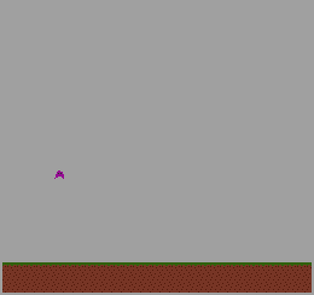

Floppy boi

Author: Jasper Lessiohadi - jlessioh

Design: Not much of a game, really. I procrastinated a little too hard and got stuck on importing png's, especially with regards to the background. I am pretty happy with how my character looks while rising and falling, though.

Screen Shot:

How Your Asset Pipeline Works:

(TODO: describe the steps in your asset pipeline, from source files to tiles/backgrounds/whatever you upload to the PPU466.)
Each of my sprites is an individual png in the sprites folder. I made a helper function in Playmode::Playmode to help decode them into individual tiles by:
    1) clearing the palette and tile entries
    2) scanning through the sprite and getting the 4 first new colors
    3) inserting the colors into the tile based on which color in the palette they match with

How To Play:

Like I said earlier, there really isn't a 'game.' I just have my little character be able to move left and right, short jump and high jump. 

This game was built with [NEST](NEST.md).

